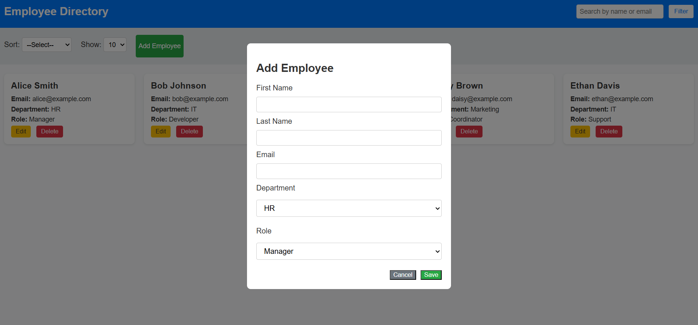
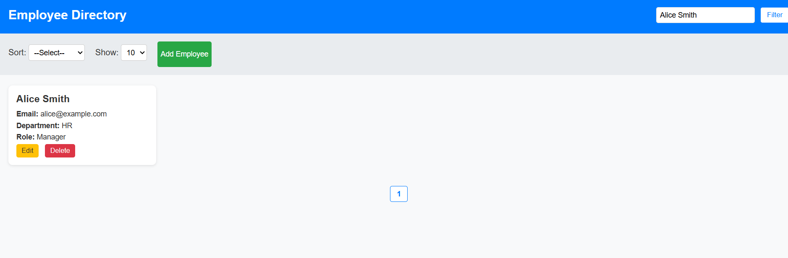

# Employee Directory

A simple, responsive Employee Directory web application built using **HTML, CSS, JavaScript**.  
This project lets you view, add, edit, delete, search, sort, filter and paginate employee data.  
All data is managed on the client side with JavaScript arrays (no backend).

---

## 🚀 Features

✅ View employees in a clean card grid  
✅ Add new employee using modal form  
✅ Edit existing employee details  
✅ Delete employee with confirmation  
✅ Search by name or email  
✅ Sort by first name or department  
✅ Show pagination with configurable items per page  
✅ Responsive design - works on desktop & mobile  

---

## 🔧 Technologies Used

- HTML5  
- CSS3 (Flexbox & Grid)  
- Vanilla JavaScript  

---

## 📁 Project Structure
1)main page

2)Add Employee

3) Filter
